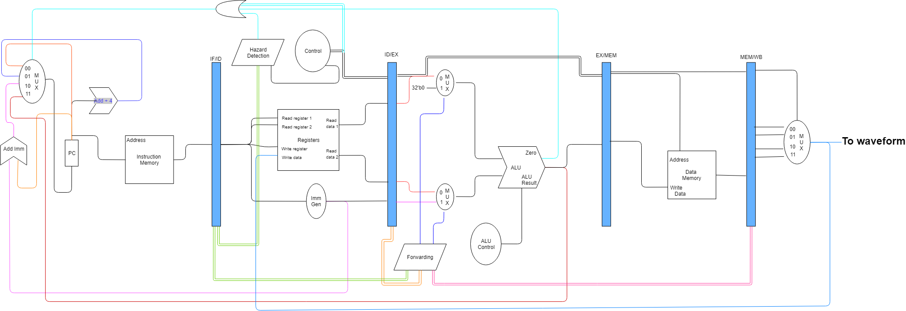
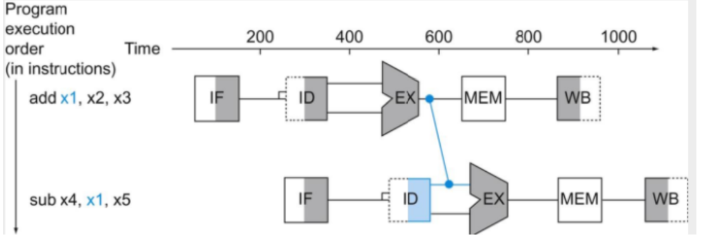
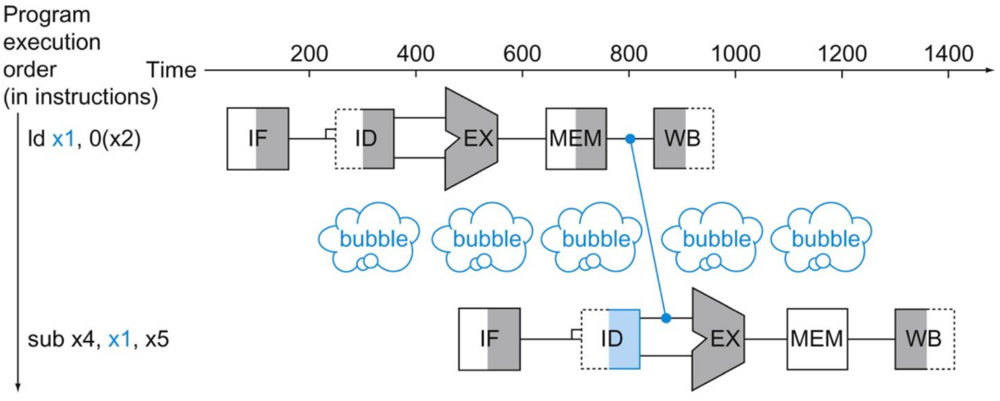
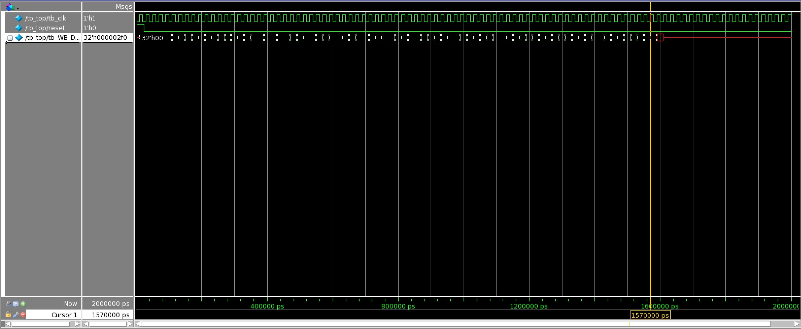
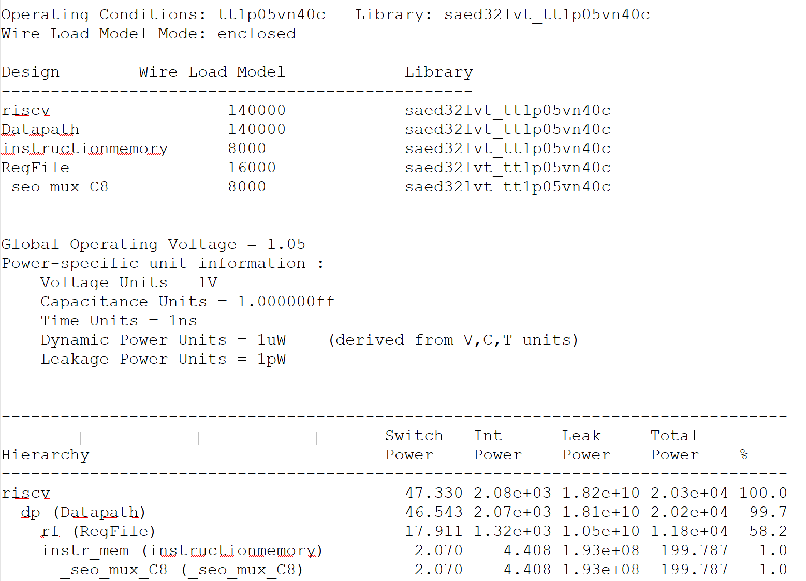
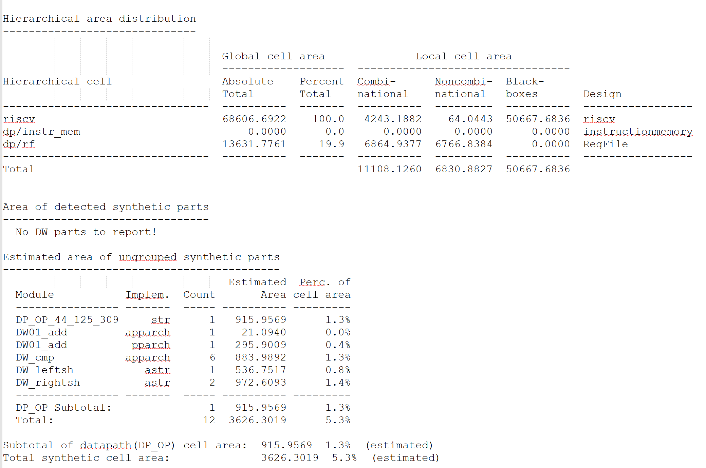
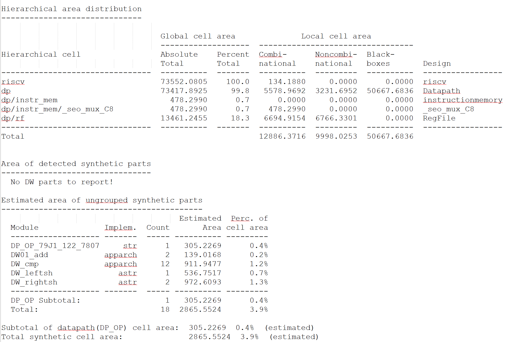
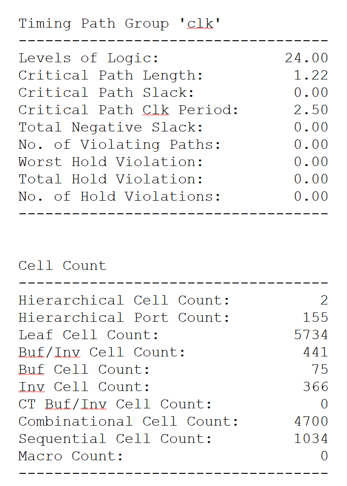
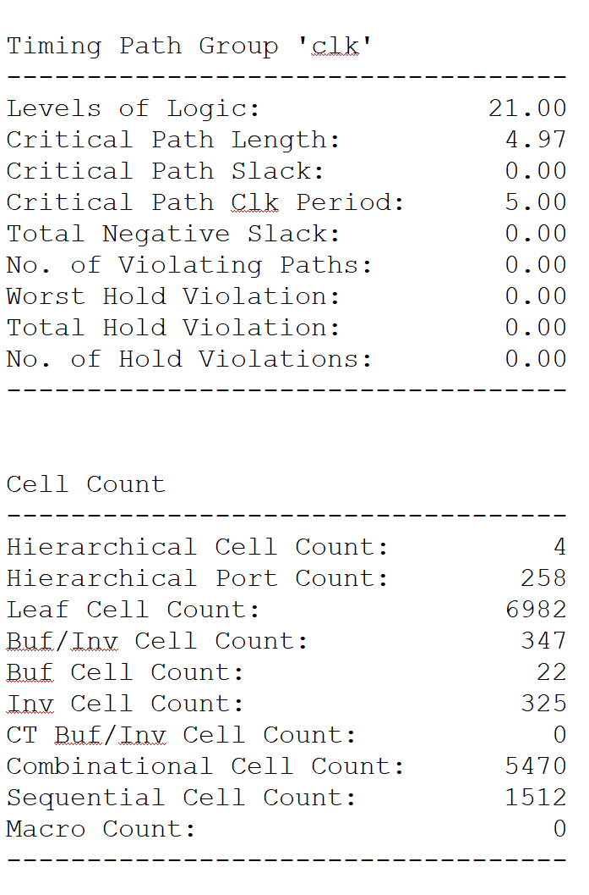

# Pipelined RISC-V Design

This project implements a multi-cycle RISC-V processor design. In pipelining, the datapath is
broken into separate stages independent from each other, named Instruction Fetch (IF), Instruction 
Decode (ID), Execution (EXE), Memory (MEM), and Write Back (WB). Each pipeline executes in a single clock 
cycle. As a result, every instruction in the RISC-V datapath takes exactly five cycles for execution.  

We can pipeline the tasks by storing separate resources between stages. The idea behind pipelining is to 
keep all stages busy simultaneously. Therefore, pipelining improves  performance by increasing the 
instruction throughput.  
* _Note: Pipelining and multi-cycle are used interchangeably throughout the README._

## Why Multi-Cycle?

Having implemented a single-cycle RISC-V processor previously, a major issue with the design was
its slow execution times per instruction. By definition, in a single-cycle design, every instruction
executes in one cycle. In other words, an instruction heavily reliant on all modules in the processor
design (e.g. Load instructions) executes as fast as an instruction not so heavily reliant (e.g. Jump 
instructions). As previously mentioned, a pipelined processor design allows for instructions to run
semi-independently from each other and considerably increases the speed at which the processor reads
instructions.

## Block Diagram



The pipelined RISC-V module contains two modules not present in single-cycle RISC-V designs: the Hazard 
Detection Unit and the Forwarding Unit. The pipelined design also includes four new data structures which
store the intermediate data between the following instruction stages:  
1. IF - ID  
2. ID - EXE  
3. EXE - MEM  
4. MEM - WB  

These data structures make running multiple instructions concurrently possible. The datapath has been
altered to allow for these pipelining registers, the hazard module, and the forwarding module.

### Hazard Detection Unit
Data hazards occur when planned instructions cannot execute in the proper clock cycle because data that
is needed to execute the instruction is not yet available. In other words, the pipeline must be stalled until
the prerequisite instruction completes. As an example, consider the scenario when the destination register of a 
_LOAD_ instruction is the same as one of the source registers of an _ADD_ instruction in the ID stage:  
```
LOAD X1, X2(100)
ADD X2, X1, X3
SUB X4, X5, X6
```
To successfully execute this sequence, the _ADD_ instruction must be immobilized in the pipeline for one cycle,
while the _LOAD_ instruction moves forward one stage. Specifically, the _LOAD_ instruction must pass the EXE stage
before the _ADD_ instruction is in the ID stage.  
``` 
if (ID/EXE.MemRead and (ID/EXE.RegDst = IF/ID.RegSrc1 or ID/EXE.RegDst = IF/ID.RegSrc2))
    // stall the pipeline
endif
```
To summarize, the Hazard Detection module checks to see whether a certain instruction is reading from the same 
location as a previous instruction is writing to, and if so, to delay the current instruction by one stage so the 
writing can complete (note: this is specifically relevant to _LOAD_ and _STORE_ instructions).

### Forwarding Unit
Forwarding simply means to retrieve the missing data from internal buffers (read: the four intermediate registers)
rather than waiting for it to arrive from programmer-visible registers or memory. RISC-V supports two types of 
forwarding:
1. Forwarding from an EXE stage of an earlier instruction to the EXE stage of another instruction entering the pipeline
at a time ```N + 2``` cycles.  
  
The following pseudo-code represents the necessary logic for the above scenario:  
```
if (EXE/MEM.RegWrite and !EXE/MEM.RegDst)
    if (EXE/MEM.RegDst = ID/EXE.RegSrc1) 
        ForwardA = 10
	endif
	if (EXE/MEM.RegDst = ID/EXE.RegSrc2)
		ForwardB = 10
	endif
endif
```

2. Forwarding for an R-format instruction following a _LOAD_ instruction. In this case, the following instruction must
be delayed by a total time of ```N + 4``` cycles.  
  
The following pseudo-code represents the necessary logic for the above scenario:  
```
if (MEM/WB.RegWrite and !MEM/WB.RegDst)
	if (MEM/WB.RegDst = ID/EXE.RegSrc1)
		then ForwardA = 01
	endif
	if (MEM/WB.RegDst = ID/EXE.RegSrc2)
		ForwardB = 01
	endif
endif
```

To summarize, the Forwarding module checks to see if the next instruction is reading from the same location as the
previous instruction; if so, pass the data from the current instruction to the next instruction, skipping the current
instruction cycle. Note that this is relevant for most ALU instructions (e.g. _ADD_, _AND_, _XOR_).

### "Instruction Fetch-Instruction Decode" Register
The IF-ID register checks to see whether or not any branching or jumping instructions occur. If not, pass the 
results of the decoding onto the next stage (e.g. source registers, destination register, relevant program counter
information). 

### "Instruction Decode-Execute" Register
The ID-EXE register checks whether any branching or jumping is occuring. If it is, the register would pass along all
relevant information (excluding data relevant to the MEM stage as nothing will be stored). Otherwise, all relevant
information from the decoding and ALU execution will be passed on normally.

### "Execute-Memory" Register
The EXE-MEM register passes along all relevant information from the ID-EXE stage to the EXE-WB stage, and occasionally
reads or writes from the memory given the instruction type (_LOAD_ or _SAVE_).

### "Memory-Write Back" Register
The MEM-WB register passes along all relevant information to be written back to the destination register. This stage
chooses whether to output the ALU result, the data from the memory, the program counter, or the external immediate
value to the relevant destination. This is the stage visible in the simulated waveform.  

## Module Simulation
The results for each instruction (defined in the test bench module) are outputted as a waveform. The waveform can be
inspected by zooming in or positioning the cursor along the relevant time range and reading the output from the WB
signal.  
  

## Module Synthesis
The following screenshots represent the synthesis reports of the design. Here's a reference of some relevant defintions:
* **critical path length** - metric to measure the relative efficiency of a processor by measuring the longest series
of sequential operations.
* **critical path slack** - The total amount of time that a cycle can be delayed without delaying the total execution time.
* **area** - the total space occupied by the processor design.

### Power
#### Single-Cycle Power
  

#### Pipelined Power
  

### Area
#### Single-Cycle Area
  

#### Pipelined Area
  

### Clock Frequency
#### Single-Cycle Frequency
  

#### Pipelined Frequency
  
